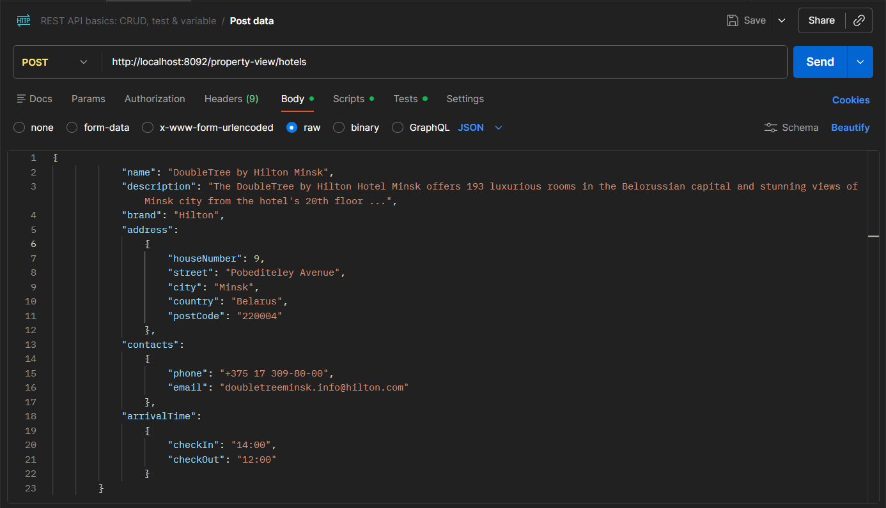
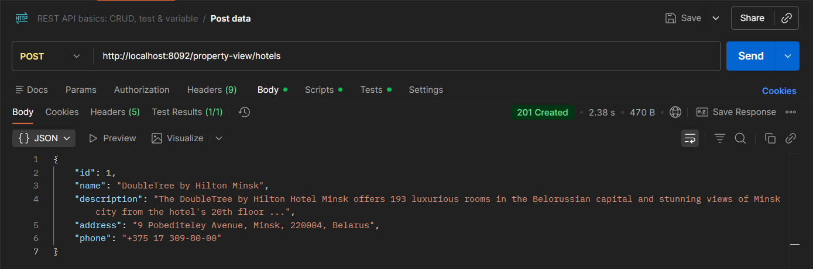
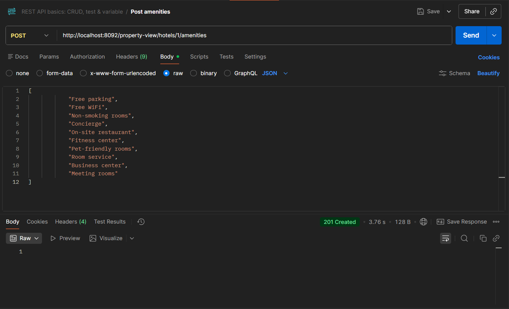
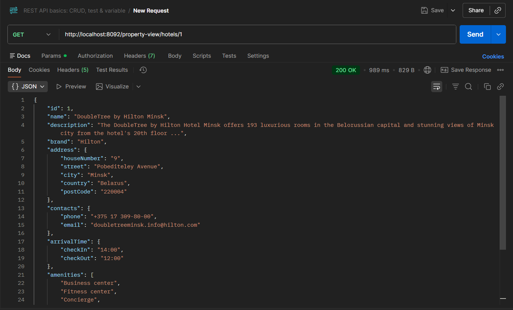
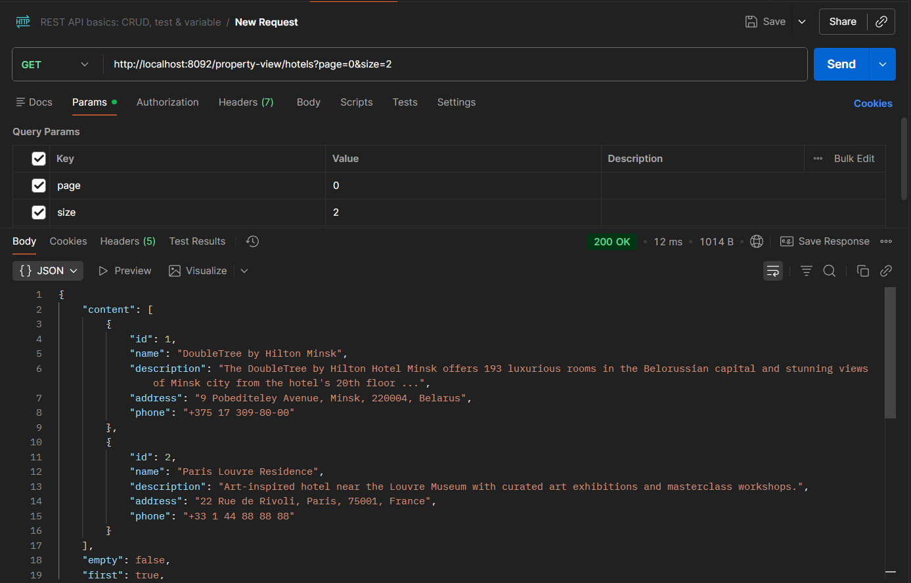
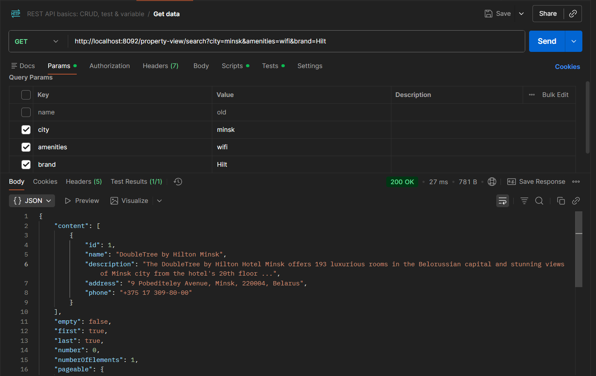
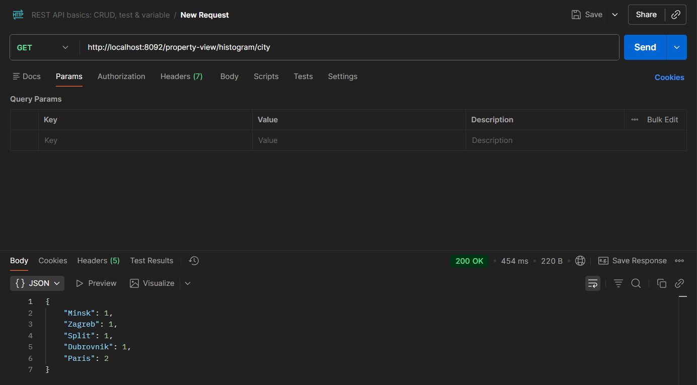
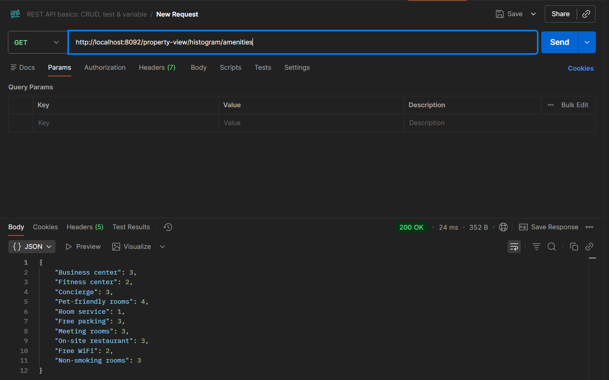

# **HotelApi**

# **Общие условия и требования к приложению**
Необходимо разработать RESTful API приложение для работы с отелями со следующими методами:
1) GET /hotels - получение списка всех отелей с их краткой информацией
2) GET /hotels/{id} - получение расширенной информации по конкретному отелю
3) GET /search - поиск получение списка всех отелей с их краткой информацией по следующим параметрам: name, brand, city, country, amenities.
4) POST /hotels - создание нового отеля
5) POST /hotels/{id}/amenities - добавление списка amenities к отелю
6) GET /histogram/{param} - получение количества отелей сгруппированных по каждому значению указанного параметра. Параметр: brand, city, country, amenities.

# **Технологии**
Технологии которые использовались в данном проекте:
- Java, версия 21
- Maven, версия 4.0.0
- База данных H2
- Spring Boot, версия 4.0.2
- Spring JPA
- Liquibase
- Validation
- MapStruct, версия 1.6.3
- SpringDoc, версия 3.0.0
- Maven checkstyle plugin

# **Требования по запуску**
С учётом требования в задании, приложение запускается из консоли при помощи команды mvn spring-boot:run
Порт для запуска: 8092. Обязательно сверить чтобы в системе была установлена java 21!

# **Демонстрация работы программы**

*Работа с POST /hotels*
===========
В первую очередь создадим отель который нам нужно добавить:

И при отправке на сервис мы получаем следующий ответ созданного отеля с его краткой информацией:

*Работа с POST /hotels/{id}/amenities*
===========

Далее добавим в наш отель услуги:

Также мы можем добавить новую услугу в тот же отель, сохраняя предыдущие

*Работа с GET /hotels/{id}*
===========

Здесь запросим данные об отеле по его id:

*Работа с GET /hotels/{id}*
===========

Просмотрим все наши отели в базе данных, также поставим параметры для пагинации:

*Работа с GET /search*
===========

Теперь посмотрим как работает поиск по параметрам, нужно уточнить что она работает как по определённым параметрам, так может и по нескольким, сразу посмотрим по нескольким: 

*Работа с GET /histogram/{param}*
===========

Теперь посмотрим получение количества отелей сгруппированных по каждому значению указанного параметра. Для примера возьмём города и услуги

